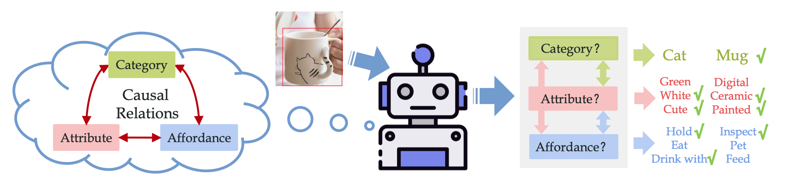

# Object Concept Learning

This the official repository of [Beyond Object Recognition: A New Benchmark towards Object Concept Learning](https://arxiv.org/abs/2212.02710) (ICCV 2023).


We propose the challenging Object Concept Learning (OCL) task to push the envelope of object understanding, requiring machines to reason out affordances and simultaneously give the reason: what attributes make an object possess these affordances. To support OCL, we build a densely annotated knowledge base including extensive annotations for three levels of ob- ject concept (category, attribute, affordance), and the clear causal relations of three levels. This repo contains our **data and annotation**, and the **code implementation**.

<p align="center"></p>


## Preparation

### Requirements

See `requirements.txt`. Python 3.8 + PyTorch 1.8.1


### Datasets

To prepare data, you should download ImageNet(2012) to `./data/ImageNet` and download the url-expired web images from [here](https://drive.google.com/drive/folders/1MDBiw45vN4qvjOA8ZuGmJmFhjMVoSBnF?usp=share_link) and put to `./data/from_web.tgz`. The folder structure should be like:
```
./data
├── from_web.tgz
├── ImageNet/
│   ├── train/
│   │   ├── n02133161/
│   │   ├── n02514041/
│   │   └── ......
│   └── val
│       ├── ILSVRC2012_val_00011812.JPEG
│       ├── ILSVRC2012_val_00036760.JPEG
│       └── ......
├── resources/
├── prepare_data.sh
└── ...
```


Then run the script to download and reorganize the rest datasets:
```
cd ./data;
sh prepare_data.sh;
```


The annotation files have been put in `./data/resources`:

- `OCL_class_*.pkl` contains the annotation of the three splits:
  - The pickle files are stored in binary, please use `"rb"` mode.
  - Each file is a list of image annotations. Each image has multiple object instances with bounding box, attributes, affordances, object category and causal rules (attribute->affordance).
  - Most files are from COCO, ImageNet-1K, aPY and SUN-attribute. Around 5K images are from the internet, whose urls are listed in `image_urls_from_web.json`. Please use the md5 (or file name) to match the files to the annotations.
- `OCL_class_*.json` contains the list of classes.


## Pretrained model


You may optionally download our pretrained OCRN model from [here](https://drive.google.com/drive/folders/1MDBiw45vN4qvjOA8ZuGmJmFhjMVoSBnF?usp=share_link).


## Usage

Extract feature and the object prior:
```
python extract_feature.py --cfg config/Faster50Feature.yaml --splits train
python extract_feature.py --cfg config/Faster50Feature.yaml --splits valtest

python calc_dataset_prior.py --feature_dir features/OCL_faster50_pt_frz
```

Train an OCRN (in three stages):

```
python -m torch.distributed.launch --nproc_per_node=4 run_ocl.py --cfg config/OCRN_stage1.yaml

python -m torch.distributed.launch --nproc_per_node=4 run_ocl.py --cfg config/OCRN_stage2.yaml --trained_weight ./logs/OCRN_stage1/checkpoint_ep170.pt --weight_type ocrn_attr

python -m torch.distributed.launch --nproc_per_node=4 run_ocl.py --cfg config/OCRN_stage3.yaml --trained_weight ./logs/OCRN_stage2/checkpoint_ep20.pt --weight_type pretrain
```


Test with GT boxes:
```
python test_ocl.py --cfg config/OCRN_stage3.yaml --trained_weight ./logs/OCRN_stage3/checkpoint_ep10.pt
```


Test on TDE metric:
```
python test_tde.py --cfg config/OCRN_stage3.yaml --trained_weight ./logs/OCRN_stage3/checkpoint_ep10.pt
```


## Reference

```
@inproceedings{li2023beyond,
  title={Beyond Object Recognition: A New Benchmark towards Object Concept Learning},
  author={Li, Yong-Lu and Xu, Yue and Xu, Xinyu and Mao, Xiaohan and Yao, Yuan and Liu, Siqi and Lu, Cewu},
  booktitle={Proceedings of the IEEE/CVF International Conference on Computer Vision},
  pages={20029--20040},
  year={2023}
}
```


## Acknowledgement

Our database is built upon [aPY](https://vision.cs.uiuc.edu/attributes/) (which also involves [PASCAL VOC](http://host.robots.ox.ac.uk/pascal/VOC/index.html)), [SUN attribute](https://cs.brown.edu/~gmpatter/sunattributes.html), [MS-COCO](https://cocodataset.org) and [ImageNet](https://www.image-net.org) (and the [ImageNet-150K dataset](https://vipl.ict.ac.cn/en/resources/databases/201803/t20180316_34793.html)).
Part of the images are collected via internet and we only provide URLs for redownloading due to licensing issues. Since some URLs have been expired or unreachable (~2K), we provide these images **for only non-commercial usage**.

Some of the images are collected from the internet, and we only offer URLs for re-download due to licensing concerns. Since certain URLs having expired or become inaccessible (~2K), we provide these images **only for non-commercial and educational use**.